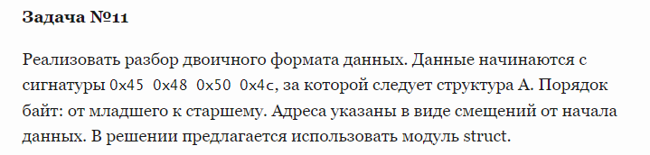
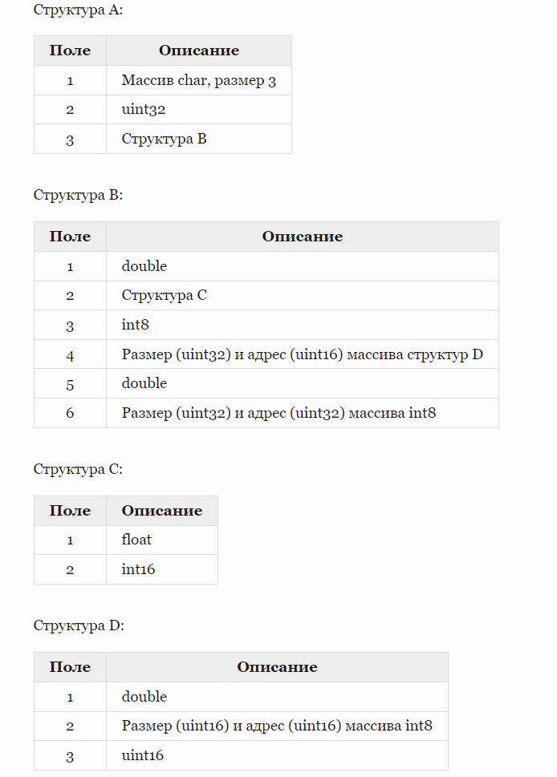
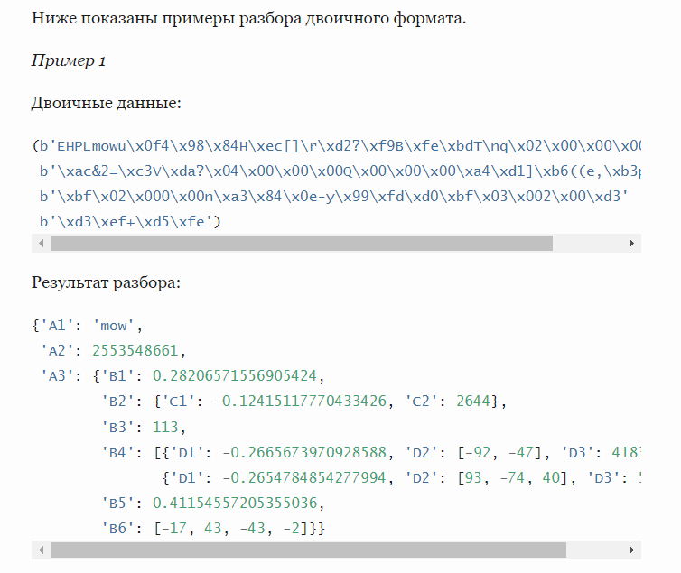
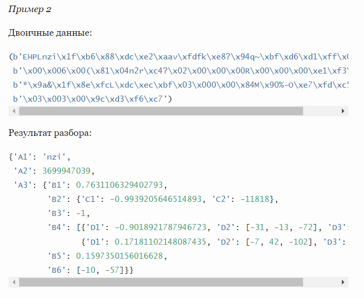

**Пример 1**

Двоичные данные:

(b'EHPLmowu\x0f4\x98\x84H\xec[]\r\xd2?\xf9B\xfe\xbdT\nq\x02\x00\x00\x005\x00'
 b'\xac&2=\xc3V\xda?\x04\x00\x00\x00Q\x00\x00\x00\xa4\xd1]\xb6((e,\xb3p\x0f\xd1'
 b'\xbf\x02\x000\x00n\xa3\x84\x0e-y\x99\xfd\xd0\xbf\x03\x002\x00\xd3'
 b'\xd3\xef+\xd5\xfe')

Результат разбора:

```{'A1': 'mow',
 'A2': 2553548661,
 'A3': {'B1': 0.28206571556905424,
        'B2': {'C1': -0.12415117770433426, 'C2': 2644},
        'B3': 113,
        'B4': [{'D1': -0.2665673970928588, 'D2': [-92, -47], 'D3': 41838},
               {'D1': -0.2654784854277994, 'D2': [93, -74, 40], 'D3': 54227}],
        'B5': 0.41154557205355036,
        'B6': [-17, 43, -43, -2]}}
```
**Пример 2**

Двоичные данные:

(b'EHPLnzi\x1f\xb6\x88\xdc\xe2\xaav\xfdfk\xe8?\x94q~\xbf\xd6\xd1\xff\x02\x00'
 b'\x00\x006\x00(\x81\x04n2r\xc4?\x02\x00\x00\x00R\x00\x00\x00\xe1\xf3\xb8\xf9'
 b'*\x9a&\x1f\x8e\xfcL\xdc\xec\xbf\x03\x000\x00\x84M\x90%-O\xe7\xfd\xc5?'
 b'\x03\x003\x00\x9c\xd3\xf6\xc7')

Результат разбора:

```{'A1': 'nzi',
 'A2': 3699947039,
 'A3': {'B1': 0.7631106329402793,
        'B2': {'C1': -0.9939205646514893, 'C2': -11818},
        'B3': -1,
        'B4': [{'D1': -0.9018921787946723, 'D2': [-31, -13, -72], 'D3': 19844},
               {'D1': 0.17181102148087435, 'D2': [-7, 42, -102], 'D3': 54172}],
        'B5': 0.1597350156016628,
        'B6': [-10, -57]}}
```